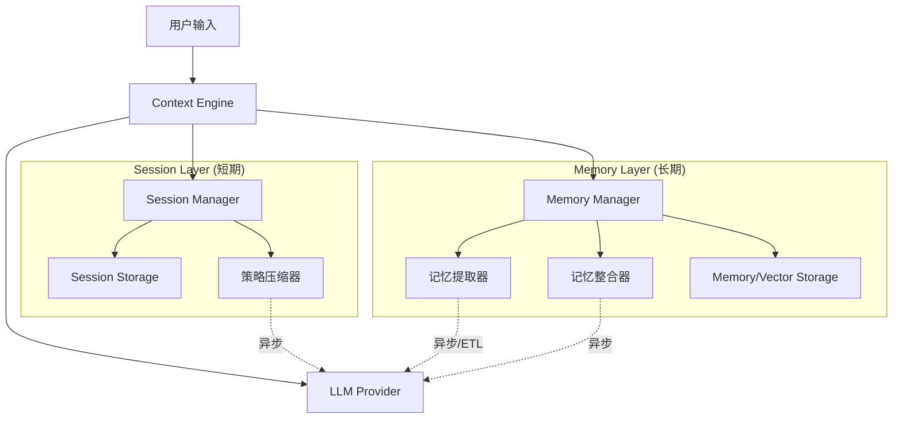

# Context Engine 技术架构文档

## 1. 简介 (Introduction)

本项目是基于 Google "Context Engineering" 白皮书理念实现的 TypeScript 版本的 Context Engine。它旨在为 LLM Agent 提供即时的会话状态管理（Session）和长期的记忆能力（Memory）。

## 核心价值与解决的问题

这个项目主要解决了 LLM 应用开发中的以下痛点：

1.  **解决"健忘"问题 (长期记忆)**
    *   **问题**: 传统的 LLM 对话是无状态的，或者仅限于当前会话窗口。一旦关闭窗口，Agent 就忘了用户的喜好、职业或项目背景。
    *   **解决方案**: 通过 `MemoryManager` 自动从对话中"提取"关键事实（如"用户喜欢 Tailwind"），存入向量数据库，并在未来的对话中自动"召回"。

2.  **突破上下文窗口限制 (无限上下文)**
    *   **问题**: LLM 的 Context Window (如 128k token) 是有限且昂贵的。无法将几年的对话历史全部塞入 Prompt。
    *   **解决方案**:
        *   **短期**: `SessionManager` 自动压缩近期对话（摘要或截断）。
        *   **长期**: 仅检索与当前 Query 语义相关的 Top-K 条记忆，实现"无限"的逻辑上下文。

3.  **降低 Token 成本**
    *   **问题**: 随着对话变长，每次 API 调用都要重复发送大量无关历史，造成巨大的 Token 浪费。
    *   **解决方案**: 精准剪裁上下文，只发送必要的信息，显著降低 API 调用成本。

4.  **构建"越用越懂你"的个性化 Agent**
    *   **场景**: 无论是客服、编程助手还是陪伴型 AI，通过记录用户的显性要求（"别用 Java"）和隐性偏好，提供定制化服务。

## Features

系统由三个主要模块组成：

1.  **Session Manager (会话管理器)**: 管理短期交互，负责由 Token 限制驱动的历史记录压缩。
2.  **Memory Manager (记忆管理器)**: 管理长期记忆，负责从对话中提取关键信息（ETL）并进行整合。
3.  **Context Engine (上下文引擎)**: 协调器，负责组装 Prompt，将系统指令、相关记忆和会话历史结合，通过 Event Bus 驱动异步流程。

### 架构图



## 3. 模块详解 (Module Details)

### 3.1 Session Manager (会话管理)

负责维护当前对话的完整性和连贯性。

*   **功能**:
    *   **事件记录**: 存储用户输入、模型响应、工具调用等事件。
    *   **状态管理**: 维护会话级变量 (State)。
    *   **自动压缩 (Auto-Compaction)**: 当对话轮数或 Token 数超过阈值时，自动触发压缩策略。
*   **压缩策略**:
    *   `truncate_oldest`: 简单的滑动窗口，丢弃最旧的消息。
    *   `token_limit`: 基于 Token 计数的智能截断。
    *   `recursive_summary`: 使用 LLM 对旧消息进行摘要，保留关键上下文。
    *   `hybrid`: 混合策略，先摘要后截断。

### 3.2 Memory Manager (记忆管理)

负责从非结构化的对话中提取结构化知识，并进行长期存储。

*   **ETL 流程**:
    1.  **Extraction (提取)**: 使用 LLM 分析对话，根据预定义的 Topic (如用户偏好、事实) 提取关键信息。
    2.  **Consolidation (整合)**: 解决新旧信息的冲突。
        *   *Deduplication*: 识别重复信息。
        *   *Conflict Resolution*: 使用 LLM 判断是合并 (Merge)、替换 (Replace) 还是忽略 (Ignore) 新记忆。
    3.  **Storage (存储)**: 将清洗后的记忆存入向量数据库，包含 Embedding 以支持语义搜索。
*   **检索策略**:
    *   结合 **语义相关性 (Relevance)**、**时间衰减 (Recency)** 和 **重要性 (Importance)** 进行综合评分排序。

### 3.3 Context Engine (核心引擎)

业务流的入口，负责编排一次完整的交互 (Turn)。

*   **流程**:
    1.  接收用户消息。
    2.  **Retrieval**: 基于用户当前 Query，从 Memory Manager 检索 Top-K 相关记忆。
    3.  **Context Assembly**: 动态构建 Prompt。
        *   System Prompt + 检索到的记忆 (In-Context Learning)。
        *   经过 Session Manager 过滤/压缩后的近期对话历史。
    4.  **Inference**: 调用 LLM 生成回复。
    5.  **Side Effects**: 异步触发记忆生成的 ETL 流程，不阻塞用户响应。

## 4. 数据结构 (Data Structures)

### Memory (记忆实体)
```typescript
interface Memory {
  id: string;
  userId: string;
  content: {
    fact: string;      // 记忆内容，例如 "用户喜欢 TypeScript"
    topic: string;     // 类别，例如 "user_preference"
  };
  provenance: {
    confidence: number; // 置信度
    sourceEventIds: string[]; // 来源追踪
  };
  embedding?: number[]; // 向量数据
}
```

### Session (会话实体)
```typescript
interface Session {
  id: string;
  events: Event[]; // 完整的事件流
  config: {
    maxTokens: number;
    compactionStrategy: 'summary' | 'truncate';
  };
}
```

## 5. 扩展性设计 (Extensibility)

*   **Storage Interface**: 提供了 `SessionStorage` 和 `MemoryStorage` 接口。默认实现了内存版 (In-Memory)，生产环境可轻松替换为 Redis (Session) 和 Pinecone/Milvus (Memory)。
*   **LLM Provider**: 通过 `LLMProvider` 接口解耦具体模型，支持 OpenAI, Gemini, Anthropic 等任意模型。
*   **Event Driven**: 内置 `EventBus`，允许开发者订阅 `memory:created`, `session:compacted` 等事件，方便进行监控或触发外部业务逻辑。

## 6. 优劣势分析

*   **优势**: 
    *   实现真正的"个性化" AI，越用越懂用户。
    *   有效控制 Token 消耗，降低成本。
    *   异步设计，保证高并发下的响应速度。
*   **劣势**:
    *   记忆整理 (Consolidation) 需要额外的 LLM 调用成本。
    *   提示词工程 (Prompt Engineering) 对记忆提取的质量影响较大。
